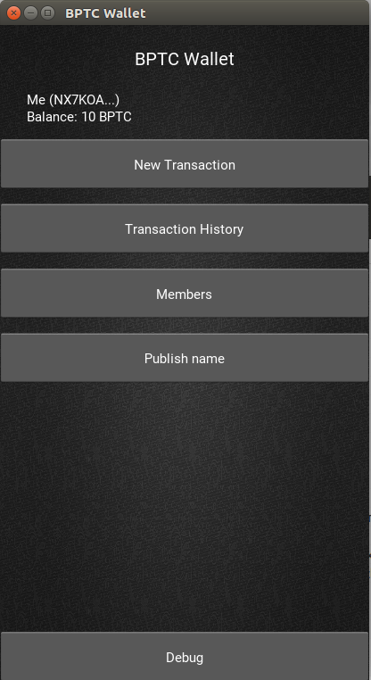

# BPT Coin Wallet
A crypto currency based on [Swirlds Hashgraph Consensus Algorithm](http://www.swirlds.com/downloads/SWIRLDS-TR-2016-01.pdf). The code is inspired by https://github.com/Lapin0t/py-swirld.



## Setup Linux
```shell
  sudo apt install cython python3-dev libffi-dev libgl1-mesa-dev
  pip install -r requirements.txt
```
You also need the libsodium.so for libnacl - Therefore download it from [here](https://download.libsodium.org/libsodium/releases/).
If you only want to run the application via the CLI you don't have to install all modules
named in requirements.txt. Instead you can use requirements_cli.txt.

## Run Kivy App (GUI)
```shell
  python main.py
```

If you get an error on startup, the `python` binary on your system might be Python 2. In this case, try running

```shell
  python3 main.py
```

## Run Console App (CLI)
```shell
  python main.py -cli
```

If you get an error on startup, the `python` binary on your system might be Python 2. In this case, try running

```shell
  python3 main.py -cli
```

## Run Headless App
```shell
  python main.py --headless
```

## Visualization

Starting bokeh
```shell
  viz.sh
```

## Docker

There is a dockerfile which sets up all command line dependencies (e.g. not kivy) and a docker-compose file defining a network of 3 clients interacting with each other.
You can find detailed descriptions on how to use docker in our repository in the wiki.

##### Build docker image
```shell
  docker build . -t chaoste/bptc
```

For more information look in the [Wiki](https://github.com/ceddie/bptc_wallet/wiki)!